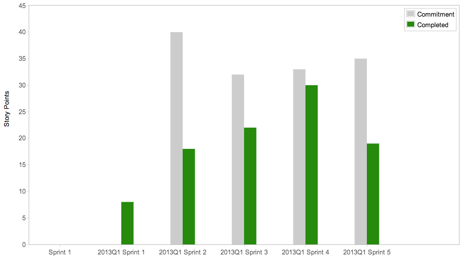
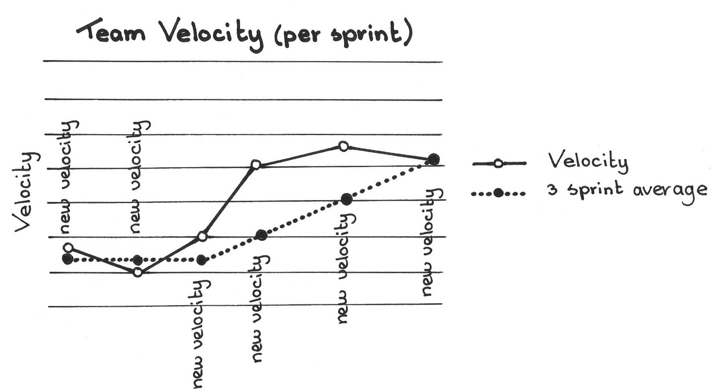

<!--
theme: gaia
class:
  - gaia
paginate: true
-->
# "Failure to plan, is planning to fail"

By failing to prepare you are preparing to fail.
_Benjamin Franklin_

La necessità della pianificazione deriva dal fatto che il tempo è una risorsa limitata e per limitare il waste le attività vanno organizzate.

---
# How do you prepare for failure? Get Ready to Fail

- Acknowledge the failure and put it in perspective. You can't begin to bounce back from a mistake if you don't admit you've made it.
- Look for causes, not blame.
- Before you wrack your brain to think up an appropriate response, take a break.
- Get some help.
- Refocus your efforts and take action.

---
# Pianificazione e Agile

La **Velocità** è la _misura_ con cui un team riesce a completare una story (secondo alla __Definition of Done__)

Questa misura, tanto più si riesce a basare sull'esperienza e su dati reali, tanto più sarà accurata.

 
---
---
# Velocità

La Velocità è un elemento fondamentale per stimare una data di consegna
