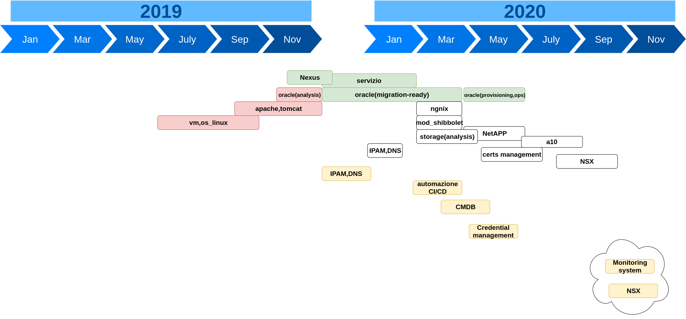

<!--
theme: gaia
class:
  - gaia
paginate: true
-->
# "Failure to plan, is planning to fail"

By failing to prepare you are preparing to fail.
_Benjamin Franklin_

La necessità della pianificazione deriva dal fatto che il tempo è una risorsa limitata e per limitare il waste le attività vanno organizzate al meglio.

---
# I 5 livelli

---
# Roadmap

- E' una tabella di marcia
- Supporto alla comunicazione
  - Milestone, Funzionalità...

---
# Pianificazione e Agile

La **Velocity**, in termini generici, è la _misura_ con cui un team riesce a completare una story

Questa misura, tanto più si riesce a basare sull'esperienza e su dati reali, tanto più sarà accurata.

---
# Pianificazione e Agile

### Scomposizione

---
# Velocity

La Velocity è un elemento fondamentale per stimare una data di consegna

Per il calcolo della velocity: solo user story completate e validate negli sprint passati (secondo alla __Definition of Done__)

 

---
# Stima

- Risponde alla necessità di capire quando si completerà una story
- La stima la deve fare il team
- Si stima la complessità e non il periodo di tempo
  - stima relativa vs stima assoluta

---
# Stima

- La stima si può eseguire con vari metodi
  - Three-point estimate
  - Planning Poker
  - Dot voting (...)
- La si può misurare in:
  - Story Points
  - Tempo [Giorni,Ore]
  - Unità di misura a piacere (pinte di birra, caffè, taglie [XS,S,M,..3XL]

---
# Stima

- Stimare in modo meno dettagliato la Story e le Epic [taglie di impegno]
- Stimare le Request/Task in modo più fine

---
# Pianificazione Agile

- Valutare la velocità del Team

In Story Point:
Vmedia = $\sum_{i=1..n} SP_i$ /n (_i=iterazioni_)
In ore:
V = $\sum_{t=1..n} ore_t$ x 0.8 (_t=TeamMember_)

---
# Pianificazione Agile

- Suddivisione del progetto in iterazioni (Sprint)
  - Durata 1-2 settimane
  - Al suo interno unità atomiche di lavoro
- Pianificazione basata su User Stories
  - Raccoglitore dei requisiti
- Processo iterativo e incrementale
- Stima dei deliverable fatta dal Team

---
# Pianificazione

- discutere le necessità/dettagli
- elencare story ed epic
- aggiungere iterazioni
- prima stima delle story
- inserire le Story nelle iterazioni
- condividere il piano

---
# Pianificazione

Quante Iterazioni?
- Dipende dal release cycle (3 mesi)

Con quale Allocazione? (Confidenza)
  - Prima iterazione (100%)
  - Seconda iterazione (75%)
  - Terza iterazione (50%)
  - ...

---
# Pianificazione Sprint

Sprint planning meeting
- Iteration commitment (User Stories)
  - Priorità (PO)
  - Chiarimenti
  - Selezione
- Task level 
  - Scomposizione in task
  - Stima
  - Assegnazione task ai membri

---
# How do you prepare for failure? Get Ready to Fail

- Acknowledge the failure and put it in perspective. You can't begin to bounce back from a mistake if you don't admit you've made it.
- Look for causes, not blame.
- Before you wrack your brain to think up an appropriate response, take a break.
- Get some help.
- Refocus your efforts and take action.

---
# Sprint Lifecycle

1. Seguire l'andamento dei task
2. Seguire Velocity (Burndown Charts)
3. Retrospective meeting
   - Input
     - Eventi significativi Sprint
   - Output
     - Remediations
     - Improvements

---
# Strumenti

Stima:
- Planning Poker

Pianificazione:
- Capacity Tracker
- Tempo Planner

---

# Riferimenti
- https://agilealliance.org/glossary
- https://hubstaff.com/tasks/agile-estimation-techniques
- http://www.agilenutshell.com/iterations
- http://www.mokabyte.it/2008/05/stimeprogetto-1/
- https://www.agileway.it/velocity-come-misurare-i-progressi-del-team/
- https://www.agileway.it/planning-poker-stima-agile-requisiti/
- https://www.humanwareonline.com/project-management/center/roadmap-progetto-prodotto/
- https://www.humanwareonline.com/project-management/center/pianificazione-rilasci-agile-scrum/
- https://www.knowledgehut.com/blog/agile/what-is-agile-planning-agile-planning-levels
- https://monday.com/blog/project-management/agile-planning/
